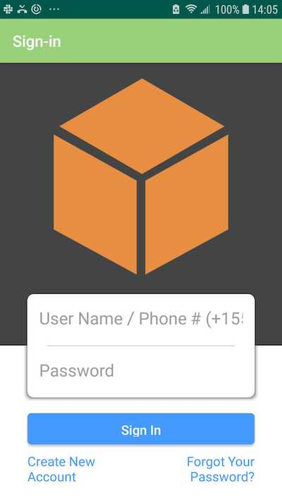

# Taskmaster
Taskmaster is an app built with Java on Android Studio that allows a user to keep track of tasks.
* Main page provides navigation to the add tasks and all tasks pages.
* Add Task page allows the user to type in details about a new task, and submit that task

## Contributor
Sharina Stubbs

# Screenshots of App:
### Homepage

# Daily Change Log in 2019:
## October 22: Day 1
* Created a new directory and repo to hold the app, named taskmaster. * Created three pages with very basic layout - homepage, add a task, all tasks. 
* The homepage has two buttons, one which allows the user to go to the Add Task view, and the other that allows the user to go to the All Tasks view. 
* Added a task page that allows users to type in a title and a body for their task. 
* Pressing the submit button shows a "Submitted!" label on the task page. 

## October 23: Day 2
* Created a Task Detail Page with a title and Lorem Ipsum description
* Created Settings page that allows users to enter their username and hit save.
* The main page was modified to contain three different buttons with hardcoded task titles. When a user taps one of the titles, it goes to the Task Detail page, and the title at the top of the page matches the task title that was tapped on the previous page.
* The homepage contains a button to visit the Settings page. Once the user has entered their username, it displays “{username}’s tasks” above the three task buttons.

## October 24: Day 3
* Created a Task class. Each task has a title, body and a state.
* Created an enum, which allows the Task state to be new, assigned, in progress or complete. 
* Refactored home page of app to display a RecyclerView to display Task data using a styled fragment.
*  Created a ViewAdapter class that displays data from a list of Tasks. 
* Data that displays on home page includes task and task body, and is from hardcoded Task data. 
* User is able to touch a task in the RecyclerView, and is directed over to a detail page, where the title is rendered correctly (for that task) on the top of that page.

## October 25: Day 4
* Modified Add Task form to save the data entered in as a Task in the local SQLite database.
* Fleshed out enum (which works with Task status) to integrate with database.
* Refactored homepage RecyclerView to display all Task entities in database.
* Description and title of a tapped task is displayed on the detail page.

## October 29: Day 5
* When application is opened, it can make a request to a backend server URL to fetch Task data using OkHTTP.

Never finished:
* Task data is displayed in the RecyclerView.
* Add Task form modified to post entered task data to the server.
* Homepage refreshes Tasks shown after a task is added.

## October 30: Day 6
* Using the amplify add api command, created a Task resource that replicates existing Task schema. 
* Updated all references to the Task data to instead use AWS Amplify to access data in DynamoDB instead of in Room.
* Modified Add Task form to save the data entered in as a Task to DynamoDB.
* Refactored homepage’s RecyclerView to display all Task entities in DynamoDB.
* Ensured that current Espresso tests are still passing.

## October 31 - Nov 1: Day 6 and 7
* Created a second entity for a team, which has a name and a list of tasks. 
* Manually created three teams by running a mutation exactly three times in the code. (user is not yet able to create his/her own teams).
* Updated tasks to be owned by a team.
* Modifed Add Task form to include  a Spinner for which team that task belongs to.
* In addition to a username, the user is allowed to type in their team on the Settings page. 
* Use that Team to display only that team’s tasks on the homepage - in process.

## November 5: Day 8
* Added Amazon Cognito to Amplify setup. 
* Added in user login and sign up flows to application
* Used Cognito’s pre-built UI as appropriate. 
* Displayed the logged in user’s username on the MainActivity.
* Users now able to log out of application.

## November 6: Day 9
* On the “Add a Task” activity, allow users to optionally select a file
* Attempted the following, but did not succeed:
  * allow users to optionally select a file to attach to a task. If a user attaches a file to a task, that file should be uploaded to S3, and associated with that task.
  * On the Task detail activity, if there is a file that is an image associated with a particular Task, that image should be displayed within that activity. (If the file is any other type, you should display a link to it.)

# Resources:
* [Android Buttons](https://developer.android.com/guide/topics/ui/controls/button.html)
* [Android UI Events](https://developer.android.com/guide/topics/ui/ui-events.html)
* [Android SharedPreferences](https://developer.android.com/training/data-storage/shared-preferences)
* [The Activity Lifecyle](https://developer.android.com/guide/components/activities/activity-lifecycle)
* [Android Studio User Guide](https://developer.android.com/studio/intro)
* [RecyclerView](https://developer.android.com/guide/topics/ui/layout/recyclerview#java)
* [Overview: Saving Data with Room](https://developer.android.com/training/data-storage/room)
* [Enum Types](https://docs.oracle.com/javase/tutorial/java/javaOO/enum.html)
* Code Fellows Seattle-Java-401d6 class demo: [Buy Cheap Stuff](https://github.com/codefellows/seattle-java-401d6/tree/master/class-29/BuyCheapStuff)
* [Overview: Saving Data with Room](https://developer.android.com/training/data-storage/room)
* [OkHttp](https://square.github.io/okhttp)
* [Android Amplify Framework - Getting Started](https://aws-amplify.github.io/docs/android/start)
* [Amplify Getting Started](https://aws-amplify.github.io/docs/)
* [Android File Picker](https://developer.android.com/guide/topics/providers/document-provider)
* [Amplify S3](https://aws-amplify.github.io/docs/android/storage)